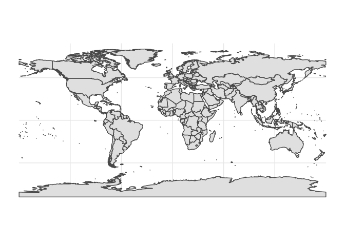
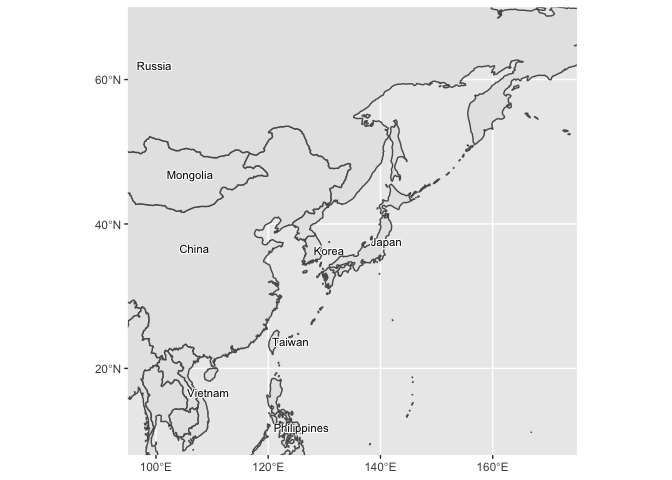
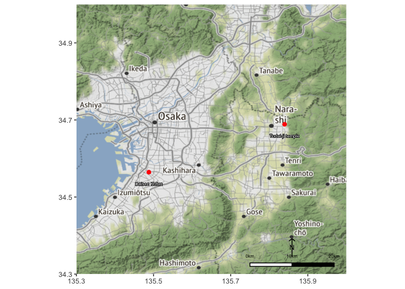
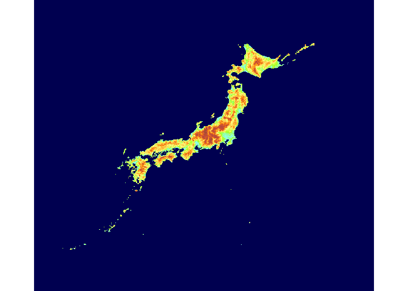
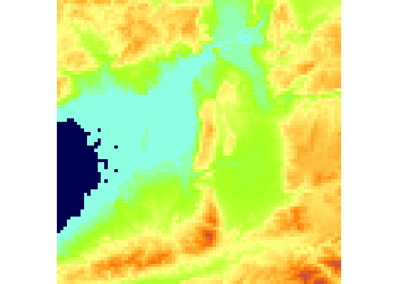
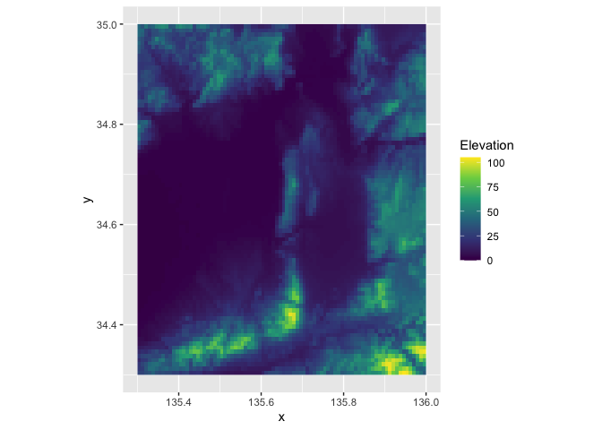
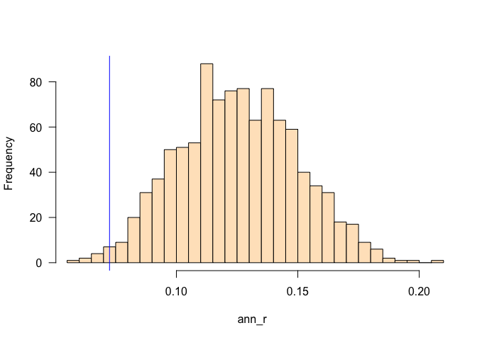

Making maps and analysing spatial data: An introduction to using R for
archaeologists
================
Liying Wang
6/14/2020

# Introduction

In this workshop, you will learn how to use R to manipulate and
visualize spatial data of interest to archaeologists. This rmd file is a
demonstration of code and you will work on it step by step to get
familiar with spatial data and basic analysis. There are three main
topics covered in this workshop:

\-Part 1: making maps, including regional map and site map -Part 2:
spatial data manipulation and visualization -Part 3: spatial data
analysis, including density analysis of sites, and hypothesis testing
for their distributions

Before getting started, make sure you have all packages we will use\! If
not, run the code below:

## Set up 1: install packages

Copy and paste the code to your console and run it:
install.packages(c(“rnaturalearth”, “rnaturalearthdata”, “ggplot2”,
“tidyverse”, “sf”, “sp”,“shadowtext”, “ggmap”, “ggspatial”, “raster”,
“spatstat”, “maptools”))

If you see a message “Do you want to install from sources the package
which needs compilation?” Type “No” on your console, press Enter, and it
will continue to download.

Copy and paste the code to your console and run it:
devtools::install\_github(‘3wen/legendMap’)

## Set up 2: create data folder to store spatial data for this workshop

``` r
# create data folder to store the raster data 
dir.create("data")
```

    ## Warning in dir.create("data"): 'data' already exists

``` r
# download the raster zip file into our data folder
download.file("https://github.com/LiYingWang/Japan_GIS_workshop_202006_LW/raw/master/workshop_data.zip", "data/raster-shapefile.zip")
# unzip to the data folder
unzip(zipfile = "data/raster-shapefile.zip", exdir = "data")
# delete zip file
unlink("data/raster-shapefile.zip")
```

# Making maps

Load world data and take a look at the data form, especially the
“geometry” column where it stores the coordinates we need for making
maps.

## Exercise 1: load data and plot the world map (5 mins)

``` r
library(rnaturalearth) # provides world map
library(rnaturalearthdata)

world <- ne_countries(scale = "medium", returnclass = "sf") # pulls country data 
class(world) # what class it is?
```

    ## [1] "sf"         "data.frame"

``` r
# type View(world) in your console to take a look at the data frame

library(ggplot2)

# plot basic world map 
ggplot(data = world) +
  geom_sf() + # adds a geometry stored in world
  theme_minimal()
```

<!-- -->

Now, we want to plot Japan with some countries around it as our regional
map. We may want to indicate the countries by adding name label on it.
To do this, we need to get the center of the country for adding country
labels, and then specify which countries we want to show their names on
the map.

## Exercise 2: make a regional map (7 mins)

``` r
library(tidyverse)
```

    ## ── Attaching packages ───────────────────────────────────── tidyverse 1.3.0 ──

    ## ✓ tibble  3.0.2     ✓ dplyr   1.0.0
    ## ✓ tidyr   1.1.0     ✓ stringr 1.4.0
    ## ✓ readr   1.3.1     ✓ forcats 0.5.0
    ## ✓ purrr   0.3.4

    ## ── Conflicts ──────────────────────────────────────── tidyverse_conflicts() ──
    ## x dplyr::filter() masks stats::filter()
    ## x dplyr::lag()    masks stats::lag()

``` r
library(sf)
```

    ## Linking to GEOS 3.7.2, GDAL 2.4.2, PROJ 5.2.0

``` r
country_centre_coords <-
  as_tibble(st_coordinates(st_centroid(world$geometry))) # for the text labels
```

    ## Warning in st_centroid.sfc(world$geometry): st_centroid does not give correct
    ## centroids for longitude/latitude data

``` r
world_points <-
  world %>%
  bind_cols(country_centre_coords) %>%
  filter(name %in% c("Japan", "China", "Korea", "Taiwan", "Russia",
                     "Philippines", "Vietnam", "Mongolia"))

library(shadowtext)

# plot map
JP_NE_Asia <-
  ggplot(data = world) +
  geom_sf() +
  geom_shadowtext(data= world_points, # add texts
                  aes(x = X, y = Y,
                      label = name),
                  color='black',
                  bg.colour='white',
                  size = 3,
                  position = position_nudge(y = 0, x = 3)) +
  coord_sf(xlim = c(95, 175), # zoom in the area of interest
           ylim = c(8, 70), 
           expand = FALSE) + # match the limits we provide
  scale_x_continuous(breaks = seq(100, 160, by = 20)) +
  scale_y_continuous(breaks = seq(20, 65, by = 20)) +
  theme(axis.title.x = element_blank(),
        axis.title.y = element_blank())

JP_NE_Asia
```

<!-- -->

We also want to make a map with archaeological sites we are interested
in. Since we would add points for sites, we have to specify the
coordinates of site location first.

## Exercise 3: make site map (7 mins)

``` r
# add site location
site_location <-
  data.frame(location = c("Daisen Kofun", "Todai-ji temple"),
             lon = c(135.487953, 135.839891),
             lat = c(34.564503, 34.688862))

library(ggmap)
```

    ## Google's Terms of Service: https://cloud.google.com/maps-platform/terms/.

    ## Please cite ggmap if you use it! See citation("ggmap") for details.

``` r
library(ggspatial)
library(legendMap)
```

    ## Loading required package: maps

    ## 
    ## Attaching package: 'maps'

    ## The following object is masked from 'package:purrr':
    ## 
    ##     map

    ## Loading required package: maptools

    ## Loading required package: sp

    ## Checking rgeos availability: TRUE

    ## Loading required package: grid

``` r
local_map <- ggmap(get_stamenmap(rbind(as.numeric(c(135.3, 34.3,
                                                    136.0, 35))), zoom = 10)) # define the range
```

    ## Source : http://tile.stamen.com/terrain/10/896/405.png

    ## Source : http://tile.stamen.com/terrain/10/897/405.png

    ## Source : http://tile.stamen.com/terrain/10/898/405.png

    ## Source : http://tile.stamen.com/terrain/10/896/406.png

    ## Source : http://tile.stamen.com/terrain/10/897/406.png

    ## Source : http://tile.stamen.com/terrain/10/898/406.png

    ## Source : http://tile.stamen.com/terrain/10/896/407.png

    ## Source : http://tile.stamen.com/terrain/10/897/407.png

    ## Source : http://tile.stamen.com/terrain/10/898/407.png

    ## Source : http://tile.stamen.com/terrain/10/896/408.png

    ## Source : http://tile.stamen.com/terrain/10/897/408.png

    ## Source : http://tile.stamen.com/terrain/10/898/408.png

``` r
site_Japan <- 
  local_map +
  geom_point(data = site_location, # add a layer of sites
             aes(x = lon,
                 y = lat),
             size = 2,
             color = "red") +
  geom_shadowtext(data = site_location, # add texts 
                  aes(x = lon,
                      y = lat,
                      label = location),
                  size = 2,
                  position = position_nudge(y = - 0.03),
                  check.overlap = TRUE) +
  coord_sf(xlim = c(135.3, 136), # define the range
           ylim = c(34.3, 35),
           expand = FALSE) +
  scale_x_continuous(breaks = seq(135.3, 136, by = 0.2)) + 
  scale_y_continuous(breaks = seq(24.3, 35, by = 0.2)) +
  legendMap::scale_bar( 
    lon = 135.75,
    lat = 34.32,
    legend_size = 2,
    # distance of one section of scale bar, in km
    distance_lon = 10,
    # height of the scale bar, in km
    distance_lat = 1,
    # distance between scale bar and units, in km
    distance_legend = 3,
    # units of scale bar
    dist_unit = "km",
    # add the north arrow
    orientation = TRUE,
    # length of N arrow, in km
    arrow_length = 5,
    # distance between scale bar & base of N arrow, in km
    arrow_distance = 3,
    # size of letter 'N' on N arrow, in km
    arrow_north_size = 3) +
  theme(axis.title.x = element_blank(),
        axis.title.y = element_blank())
```

    ## Coordinate system already present. Adding new coordinate system, which will replace the existing one.

    ## Scale for 'x' is already present. Adding another scale for 'x', which will
    ## replace the existing scale.

    ## Scale for 'y' is already present. Adding another scale for 'y', which will
    ## replace the existing scale.

``` r
site_Japan
```

<!-- -->

We can save the map using ggsave function below the plot we would like
to save.

``` r
# save the map to your folder 
ggsave(here::here("Japan-site-map.jpg"),
       width = 60,
       height = 60,
       dpi = 300,
       units = "mm")
```

# Spatial data manipulation and visualization

The raster data is DEM data downloaded from
<https://www.gsi.go.jp/kankyochiri/gm_japan_e.html>. We want to crop the
area that matches the site map from this DEM data. Here, we use
coordinates to create a data frame, convert it to a spatial object, and
then use it to crop the raster.

## Exercise 4: crop an area from raster data (7 mins)

``` r
library(raster)
```

    ## 
    ## Attaching package: 'raster'

    ## The following object is masked from 'package:dplyr':
    ## 
    ##     select

    ## The following object is masked from 'package:tidyr':
    ## 
    ##     extract

``` r
# read in data from data folder
DEM_Japan <- raster("data/workshop_data/jpn/el.tif")

# assign coordinate reference system
crs(DEM_Japan) <- "+proj=lcc +lat_1=41.03333333333333 +lat_2=40.66666666666666 +lat_0=40.16666666666666 +lon_0=-74 +x_0=300000 +y_0=0 +ellps=GRS80 +towgs84=0,0,0,0,0,0,0 +units=us-ft +no_defs"

plot(DEM_Japan) # take a look at raster data
```

<!-- --><!-- -->

``` r
# define the area that we want to crop from the DEM
x_coord <- c(135.3, 135.3, 136, 136, 135.3)
y_coord <- c(34.3, 35, 35, 34.3, 34.3)
xym <- cbind(x_coord, y_coord)

library(sp)
p = Polygon(xym) # convert the matrix to polygon
ps = Polygons(list(p),1) # make lists
sps = SpatialPolygons(list(ps)) # convert to Spatial Polygons
crs(sps) <- crs(DEM_Japan) # define coordinate reference system
crop_DEM <- crop(DEM_Japan, sps) # crop a raster to the extent of specified spatial object
plot(crop_DEM)
```

<!-- --><!-- -->

``` r
summary(crop_DEM)
```

    ##          el
    ## Min.      0
    ## 1st Qu.   4
    ## Median   14
    ## 3rd Qu.  33
    ## Max.    105
    ## NA's      0

We can plot the raster data using ggplot function, which allows us to
modify axis, legend, and labels displayed on the plot. To use ggplot, we
need to convert the cropped raster to a dataframe.

``` r
# cover to a dataframe for ggplot
crop_DEM_df <- as.data.frame(crop_DEM, xy = TRUE)
# plot
ggplot() +
  geom_raster(data = crop_DEM_df , aes(x = x, y = y, fill = el)) +
  scale_fill_viridis_c(name = "Elevation") +
  coord_quickmap() # plot faster
```

<!-- -->

Now, let’s work on vector data and plot it on the raster. We import a
shapefile which contains site locations we want to explore (note: its
not a real data). We are curious about the distribution of
archaeological sites and how they relate to the elevation of this area.

## Exercise 5: explore shapefile and map it on the raster layer (7 mins)

``` r
crop_DEM_df <- as.data.frame(crop_DEM, xy = TRUE)
# Example of archaeological sites
sites_location <- st_read("data/workshop_data/sites_example.shp")
```

    ## Reading layer `sites_example' from data source `/Users/EmilyWang/Desktop/School document/Workshops/Japan_GIS_workshop_202006_LW/data/workshop_data/sites_example.shp' using driver `ESRI Shapefile'
    ## Simple feature collection with 20 features and 2 fields
    ## geometry type:  POINT
    ## dimension:      XY
    ## bbox:           xmin: 135.412 ymin: 34.349 xmax: 135.951 ymax: 34.923
    ## CRS:            NA

``` r
crop_DEM_df %>% 
  ggplot() + 
  geom_raster(aes(x = x, y = y, fill = el)) +
  geom_sf(data = sites_location, aes(color = Period)) + # add site shapefile
  scale_color_manual(values=c("red", "black")) + # change default color
  scale_fill_viridis_c(name = "Elevation") +
  coord_sf() # all layers use a common CRS
```

<!-- -->

We are curious about the elevation of the locations of archaeological
sites, and would like to compare sites from two phases: Yayoi and Kofun.

## Exercise 6: extract elevation and make a plot to compare sites from two phases (5 mins)

``` r
# convert sf (simple feature) to a spatial object
sp_sites_location <- as(sites_location, "Spatial")

# extract elevation for each site
elevation <- extract(crop_DEM, sp_sites_location, 
                     method = "simple") # use values for the cell a point falls in
sites_location <- cbind(sites_location, elevation)

sites_location %>% 
  ggplot(aes(Period, elevation)) + 
  geom_boxplot() +
  theme_minimal()
```

<!-- -->

# Density analysis and hypothesis testing

We may want to know the distribution pattern of the sites across this
area. We can visualize the density to check any hot spots using kernal
density estimation.

## Exercise 7: make a kernel density plot (7 mins)

``` r
library(spatstat)
```

    ## Loading required package: spatstat.data

    ## Loading required package: nlme

    ## 
    ## Attaching package: 'nlme'

    ## The following object is masked from 'package:raster':
    ## 
    ##     getData

    ## The following object is masked from 'package:dplyr':
    ## 
    ##     collapse

    ## Loading required package: rpart

    ## Registered S3 method overwritten by 'spatstat':
    ##   method     from
    ##   print.boxx cli

    ## 
    ## spatstat 1.64-1       (nickname: 'Help you I can, yes!') 
    ## For an introduction to spatstat, type 'beginner'

    ## 
    ## Attaching package: 'spatstat'

    ## The following objects are masked from 'package:raster':
    ## 
    ##     area, rotate, shift

``` r
library(maptools)
crop_DEM_df <- as.data.frame(crop_DEM, xy = TRUE)

# get two columns, one longitude and another is latitude
sites_location_coords <-
  sites_location %>% 
  st_coordinates() %>% 
  as.data.frame 

# convert to ppp object that represent a two-dimensional point pattern
sites_location_ppp <- ppp(x = sites_location_coords$X,
                          y = sites_location_coords$Y,
                          range(crop_DEM_df$x), # set window, means the extent of an area
                          range(crop_DEM_df$y))

K1 <- density(sites_location_ppp) 

plot(K1, main=NULL, las=1)
contour(K1, add=TRUE)
```

<!-- -->

Is the hot spots we observed significant? We can simulate the site
locations and testing our hypothesis to determine if the distribution is
random or not random.

## Exercise 8: simulation and plot the histogram (7 mins)

``` r
# get the mean distance for our observation
ann_p <- mean(nndist(sites_location_ppp, k=1))
n     <- 1000 # Number of simulations

ann_r <- vector(length = n) # an object for storing simulated ANN values

# simulation
for (i in 1:n){
  rand_p   <- rpoint(sites_location_ppp$n, 
                     win = as.owin(crop_DEM_df))  # generate random point locations
  ann_r[i] <- mean(nndist(rand_p, k=1))  # tally the ANN values
}

# plot the histogram and add our observed ANN value line
hist(ann_r, main=NULL, las=1, breaks=40, 
     col = "bisque", 
     xlim = range(ann_p, ann_r))
abline(v = ann_p, col="blue") # the observed value
```

<!-- -->

We have looked at the distribution of sites all together, but what if we
want to focus on sites from a phase; for example, we want to explore
Kofun period. We can filter out the phase we want and then use the same
method to test the Kofun sites.

## Quiz: Do the Kofun sites ramdonly distributed or non-ramdonly distributed? The pattern is clustterd or dispersed?

``` r
sites_location_coords_kofun <-
  sites_location %>% 
  st_coordinates() %>% 
  as.data.frame () %>% 
  bind_cols(sites_location) %>% 
  filter(Period == "Kofun")

sites_location_ppp_kofun <- (ppp(x = sites_location_coords_kofun$X,
                                 y = sites_location_coords_kofun$Y,
                                 range(crop_DEM_df$x),
                                 range(crop_DEM_df$y))) 

K2 <- density(sites_location_ppp_kofun) 

plot(K2, main=NULL, las=1)
contour(K2, add=TRUE)
```

<!-- -->

``` r
ann_p <- mean(nndist(sites_location_ppp_kofun, k=1))
n     <- 1000 # Number of simulations

ann_r <- vector(length = n) # an object for storing simulated ANN values

# simulation
for (i in 1:n){
  rand_p   <- rpoint(sites_location_ppp_kofun$n, 
                     win = as.owin(crop_DEM_df))  # Generate random point locations
  ann_r[i] <- mean(nndist(rand_p, k=1))  # Tally the ANN values
}

# plot the histogram and add our observed ANN value line
hist(ann_r, main=NULL, las=1, breaks=40, 
     col = "bisque", 
     xlim = range(ann_p, ann_r))
abline(v = ann_p, col="blue")
```

<!-- -->
